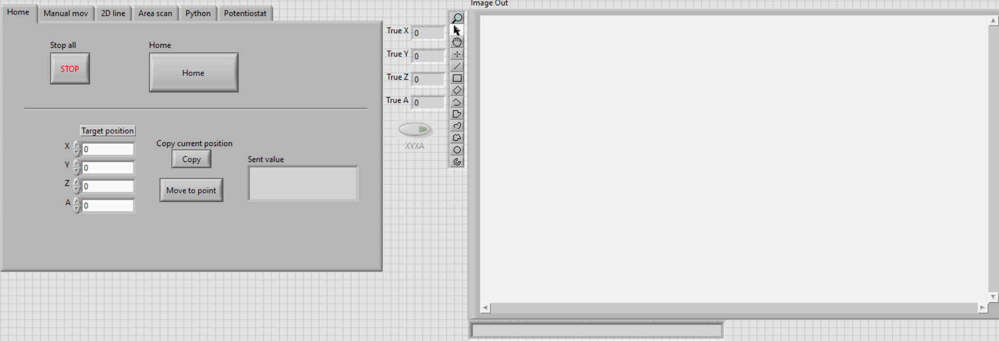
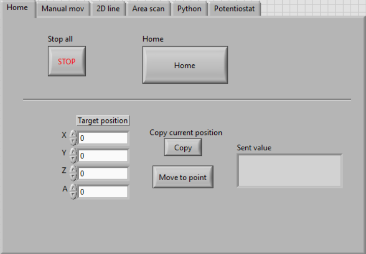

# SMART-SECM
**[Scanning Electrochemical Microscope (SECM)]{.mark}**

**[Product Manual]{.mark}**

# [Introduction]{.mark}

[This manual helps you to get familiar with the SECM. Whether manually
controlling the microscope\'s movement or using some of the automatic
movement features, you can use the program by intuition or after some
time exploring. Our software is open-access and based on
Labview.]{.mark}

# [Structure of the SECM program]{.mark}

[Starting the program will open the main screen (Figure 1.) with two
main parts. The left is the feature control, giving you access to all
the features by changing through the tabs. The right screen is the
camera image output, with some inbuilt features like zoom, dragging, and
drawing over the image.]{.mark}

{width="6.267716535433071in"
height="2.138888888888889in"}

**[Fig. 1. Central control panel (left) and camera image output
(right)]{.mark}**

[**Notice\*** If there is a problem with the TCP connection with the
controller (Raspberry Pi) or the camera, an error notice will appear,
and the program will not run.]{.mark}

##  [Home tab]{.mark}

[The home tab aids with automatic movement, which is usually most useful
when starting a run.]{.mark}

{width="4.192708880139983in"
height="2.9116032370953633in"}

**[Fig. 2. Central control panel (Home tab).]{.mark}**

[When the program starts, and the camera image is visible, the program
is running correctly, and you can push the home button.]{.mark}

[When turning on the controller, the current position is set to 0,0,0,0,
even if it is not. The home position will ensure to have a constant
starting and origin point.]{.mark}

## [Stop all.]{.mark}

[By pressing Stop All, the currently executed command is aborted, and
the program will stop shortly.]{.mark}

##  [Copy the Current position and move to point]{.mark}

[It is helpful to use this feature when multiple axes must be changed
simultaneously to a known position. It moves at maximum allowed speed,
which is especially useful when moving many axes over considerable
distances.]{.mark}

[The move-to-point button will move ALL axes to the specified
coordinates. Therefore, use the Copy current position feature and edit
only the axes you want to move.]{.mark}

##  [Manual *mov* tab]{.mark}

[This tab allows more effortless single-axis movement. There are two
movement types: ***Step*** and ***Jog***. Use the slide switch to change
between the two movement types.]{.mark}

{width="4.026042213473316in"
height="2.808865923009624in"}

**[Figure 2. Central control panel (Manual mov tab).]{.mark}**

## [*Jog* button]{.mark}

[***Jog*** allows you to continuously move in a specified axis if the
button is pressed. The speed of this movement can be changed with the
dial on the right-hand side.]{.mark}

[After the button is released, the ***XYZA*** light will turn ON for a
short duration. This means that the current position is being
updated.]{.mark}

[**Note\*** If an axis jog button is pushed while this ***XYZA*** light
is ON, it may overload the connection, and an error message will appear.
Make sure to press the buttons only after this light turns off. If the
error message appears, you can rerun the program and continue from where
you left off. If the light does not turn OFF and the coordinates do not
move, you can rerun the program and continue from where you left
off.]{.mark}

## [*Step* button]{.mark}

[Steps allow you to move a specified distance. Specify the step size for
movement, and then you move any axis.]{.mark}

## [Line Scan (*2D Line*)]{.mark}

[This feature allows you to move in a straight line with intermediate
pauses on the XY plane.]{.mark}

{width="4.574475065616798in"
height="3.1721522309711285in"}

**[Figure 3. Central control panel (2D line tab).]{.mark}**

[To do so:]{.mark}

-   [Insert the initial starting coordinates of X0 and Y0. (It is faster
    to move to the starting position with the ***Home*** target position
    and then do the ***2D line***),]{.mark}

-   [Insert the ***Finish*** position,]{.mark}

-   [Insert in how many steps you want to accomplish this line. (1 step
    is one continuous line),]{.mark}

-   [Change the waiting time,]{.mark}

-   [Change the speed,]{.mark}

-   [Push start.]{.mark}

[If you want to cancel the movement halfway, press ***stop***.]{.mark}

##  [*Area scan* tab]{.mark}

[The ***area scan*** allows the scan of a fixed area and continuous
displacement.]{.mark}

{width="4.578125546806649in"
height="3.2016458880139984in"}

**[Figure 4. Central control panel (*Area scan* tab).]{.mark}**

[To do so:]{.mark}

-   [Choose the ***speed***,]{.mark}

-   [Choose the ***start*** and ***end*** position corners (X0, Y0, X1,
    Y1),]{.mark}

-   [Choose the ***step size*** and ***line displacement***
    values,]{.mark}

-   [Choose the wait time ***Wait (ms)*** during every pause,]{.mark}

-   [Push ***Start***.]{.mark}

##  [Potentiostat]{.mark}

[To use the potentiostat, Select the correct ***VISA resource name***
from the drop-down list and press ***Check port***. If the "Config
Status\'\' bar does not fully load or the Status light turns red, rerun
the program, and select the correct ***VISA resource name***.]{.mark}

[Once the potentiostat starts reading values, other controller features
can be used. The values are displayed on the ***Actual I/U***
indicator.]{.mark}

{width="4.876558398950131in"
height="3.3642771216097986in"}

**[Figure 5. Central control panel (Potentiostat tab).]{.mark}**

[The Potentiostat will work (in the Amperometric Detection Technique)
for one hour. This time can be changed in the Common Pram string array
(Fig 6).]{.mark}

{width="3.4583333333333335in"
height="1.6770833333333333in"}

**[Figure 6. Standard Pram string array in the block diagrams.]{.mark}**

[**Note\*** The potentiostat must stop using the STOP button in the
Potentiostat tab. Otherwise, it will be tasked to read values even if
the emergency stop is used.]{.mark}

[**The control interface** comprises 6 tabs (Python tab in blank), where
the different movements and controls are spread. The Home Tab allows to
home position the motors and to move all motors to a specific axis
position.]{.mark}

{width="4.457646544181977in"
height="2.993174759405074in"}

**[Figure 7. The control interface.]{.mark}**

[**The "Manual mov" tab** allows users to move every microscope axis
independently. In the Jog mode, the speed is adjustable with the dial on
the right side of the controller. In the Step mode, the step size is
adjustable with a numeric control on the right side of the
controller.]{.mark}

{width="4.645287620297463in"
height="3.195240594925634in"}

**[Figure 8. The "Manual mov" tab.]{.mark}**

[**The "2D line" tab** allows users to move the motors in a line in one
or two axes. For example, it can be a line only in the X axes or a
diagonal across the XY plane.]{.mark}

[The user is required to enter:]{.mark}

[- Initial and final position of the line,]{.mark}

[- Speed with limits from 1 to 500μm/s,]{.mark}

[- Number of steps (how many evenly distributed steps wanted to finish
the line; if only one constant line is wanted, the number of steps must
be 1).]{.mark}

[- Wait time in between every step.]{.mark}

{width="4.397391732283465in"
height="3.095599300087489in"}

**[Figure 9. The "2D line" tab]{.mark}**

[**The "Area scan" tab** allows movement across an area. To do so, the
following details are required:]{.mark}

[Coordinates off opposing corners of the area,]{.mark}

-   [Step size,]{.mark}

-   [Line displacement,]{.mark}

-   [Wait time wanted in between every step,]{.mark}

-   [Speed with limits from 1 to 500μm/s.]{.mark}

{width="4.668225065616798in"
height="3.2140146544181976in"}

**[Figure 10. The "Area scan" tab]{.mark}**

[**The "Potentiostat" tab** allows you to start the potentiostat to read
values. This part of the program has been taken from the uStat400
program. The config status bar above will load after the VISA resource
name is correctly selected (usually COM3), and "Check port" is pressed.
If an error occurs, the Status light on the top right corner will turn
red, in where the program must be restarted and resumed.]{.mark}

{width="5.397731846019248in"
height="3.7289916885389327in"}

**[Figure 11. The "Potentiostat" tab]{.mark}**

**Image Out:** [The vision acquisition window displays what the camera
sees. It displays a full view of the image in real time, and it has some
tools that allow for some manipulation of the image such as zooming in
and out, drawing among others.]{.mark}

{width="5.814443350831146in"
height="3.488665791776028in"}

**Figure 12. Image Out dialog.**

[Make sure to change **the TCP address**, where the program will connect
to the other computer and send commands.]{.mark} {width="5.536458880139983in"
height="1.8669455380577429in"}

**Figure 13. Block diagram with TCP address.**

[**The Vision Acquisition block** is connected to a specific camera
device. Meaning that its properties should be edited when connecting to
a new camera.]{.mark}

{width="4.018486439195101in"
height="2.630125765529309in"}

**[Figure 14. The Vision Acquisition block]{.mark}.**

[When the potentiostat is started, it will continuously work for an
hour, reading values every 0.1 seconds. These values can be changed in
the **Common pram string array**.]{.mark}

{width="3.693436132983377in"
height="2.3320734908136482in"}

**[Figure 15. Common pram string array.]{.mark}**

[The following loop is needed to receive the axis coordinates. They turn
on and off when needed, reading all values or just from one. Because of
this, repeated fast manual movements might overload the
connection.]{.mark}

{width="4.871233595800525in"
height="3.244792213473316in"}

**[Figure 16. Loop to receive axis coordinates.]{.mark}**

[Most functions work as a State machine, although 2D Line and Area scan
do not. This is because of the repetitive nature of the process, in
which loops were avoided. This is why there are separate cases for these
functions.]{.mark}

{width="6.267716535433071in"
height="1.3194444444444444in"}

**[Figure 17. Scanning functions.]{.mark}**
